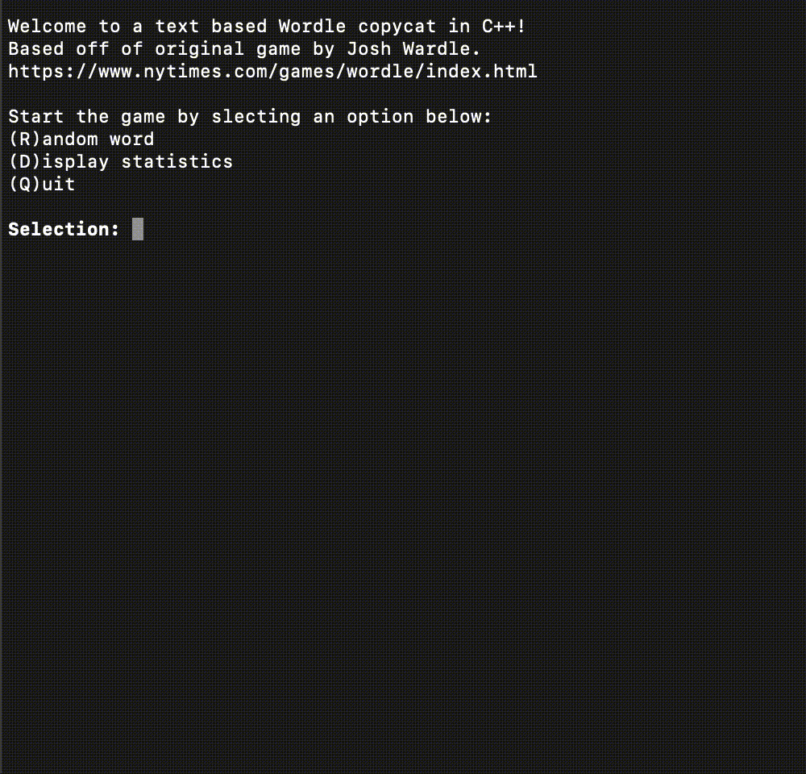

# Welcome to wordle-copycat!

A command line copycat of Wordle built in C++ <br> <br>
Based off of original game [Wordle](https://www.nytimes.com/games/wordle/index.html) by Josh Wardle. <br> <br>


## Usage

In order to play the game follow these steps. <br> <br> 
First, move into your wordle-copycat directory.
```zsh
cd path/to/your/wordle-copycat
```
Then compile the game using the provided Makefile by entering the following command.
```zsh
make
```
Once everything is complete its time to play the game!
```zsh
./play
```
You will be prompted with the start menu of the game where you can select between options including guessing a word, displaying your career statistics or closing and quitting the game entirely.
```zsh
Welcome to a text based Wordle copycat in C++!
Based off of original game by Josh Wardle.
https://www.nytimes.com/games/wordle/index.html

Start the game by slecting an option below: 
(R)andom word
(D)isplay statistics
(Q)uit

Selection:
```
To select an option, simply type the first letter of the menu item (also included in the parentheses) and press enter.
```zsh
Selection: r

Enter your guess: 
```
Congratulations you are now playing wordle-copycat! Type out your guess at each prompt and press enter to confirm your guess and you will be displayed how your word compares to the answer in classic Wordle fashion. At the end of each round you will be prompted whether you would like to play again on guessing another word or be directed back to the start menu to choose a different option. 

Now it's time for you to play the game and have some fun!

When you're done with the program simply type the following command to clean up the files.
```zsh
make clean
```


## TODO
#### Known issues
- Duplicate letters in guess do not display correctly
  - When a guess contains two of the same letter and the answer only contains one of that letter, both letters will be highlighted (green or yellow) rather than just one being being highlighted and the other being grey as per the orginal game.

#### Needs improving
- Career statistics should be written to file and read from when user wants to display their statistics
  - This way the statistics will act as true career statistics and stay even after the game has been closed
- Pass by refrence everything
  - There's really no need to be making copies of strings over and over again so I might as well convert text to upper case or lower case and just access that variables memory all of the time.
